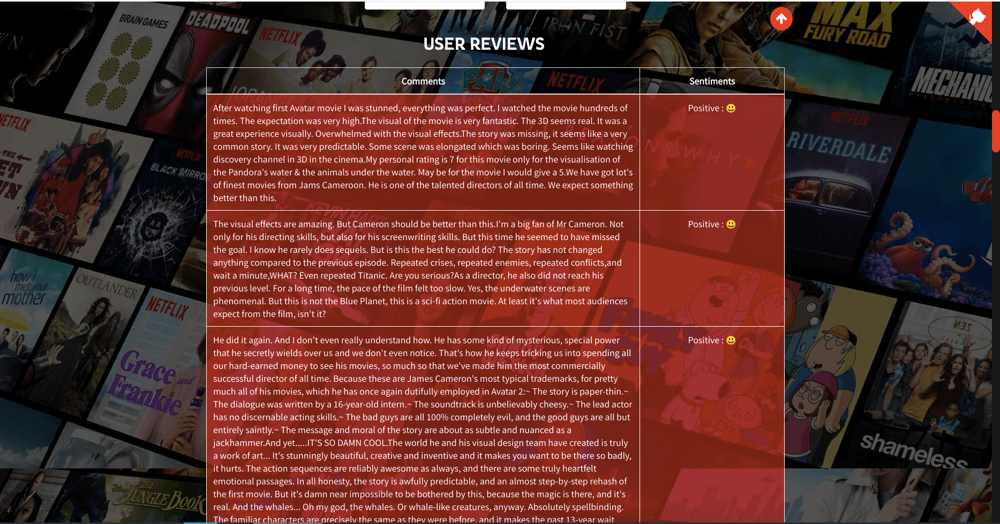

This application offers comprehensive information about the requested movie, including an overview, genre, release date, rating, runtime, top cast, reviews, recommended movies, and more.

# API Key
 Get API key from https://www.themoviedb.org/ then replace YOUR_API_KEY in static/recommend.js file by your api key

# Data
1. [IMDB 5000 Movie Dataset](https://www.kaggle.com/datasets/carolzhangdc/imdb-5000-movie-dataset)
2. [The Movies Dataset](https://www.kaggle.com/datasets/rounakbanik/the-movies-dataset)
3. [List of American films 2018-2024](https://en.wikipedia.org/wiki/List_of_American_films_of_2018)
 # ENV
 ```bash
 conda create -n cinema python==3.9
 
 conda activate cinema
 
 pip install -r requirements
```
# Run
Extract the zip file for data as it is too large to upload to github. Some data may be missing due to github size limit; manually collect them by source and notebook.
```bash
fastapi run app.py
```
# Demo



